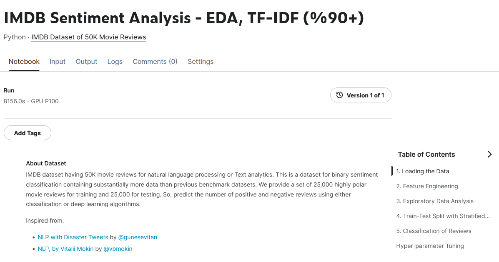

# IMDB Sentiment Analysis
This is a dataset for binary sentiment classification containing substantially more data than previous benchmark datasets. We provide a set of 25,000 highly polar movie reviews for training and 25,000 for testing.

For more dataset information, please go through the following link,
http://ai.stanford.edu/~amaas/data/sentiment/

### Notebook overview

### On Kaggle
https://www.kaggle.com/code/mehmetcandemir/imdb-sentiment-analysis-eda-tf-idf-90/
